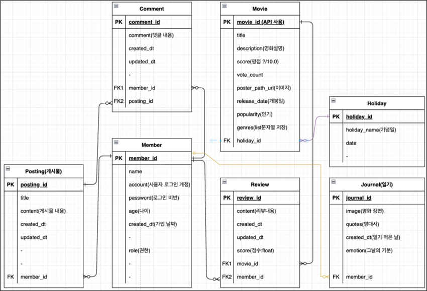
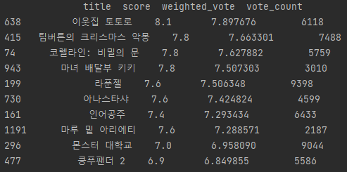

### Movie Project

#### :heavy_check_mark:핵심

기간 : 2022/05/16 ~ 2022/05/26

프로젝트 요약 : 영화를 좋아하는 사람들을 위한 커뮤니티 사이트 구현`

역할 : 팀원

* 총 2명의 팀원으로 프로젝트 구현
* 콘텐츠 기반 필터링을 이용한 영화 추천 시스템 기능 구현
* 분업과 협업을 통해 웹 페이지의 프론트엔드 구현
* 데이터를 이용한 프로젝트를 할 때마다 느끼는 것이지만 데이터의 중요성에 대해 다시 생각해보게 되었다.
  * 예를 들어 지브리의 '센과 치히로의 행방불명'와 유사한 영화를 추천하고 싶다면 직관적으로 지브리 애니메이션 영화인 '이웃집 토토로', '하울의 움직이는 성' 같은 영화가 우선적으로 추천되면 좋을 것 같다는 생각이 든다.
  * 하지만 단순히 장르에 대한 콘텐츠 기반 필터링 + 가중 평점을 이용하는 경우에는 '팀버튼의 크리스마스 악몽', '코렐라인: 비밀의 문'과 같은 영화가 우선적으로 추천된다.
  * 아무래도 해당 영화가 지브리 영화보다 대중적으로 인지도가 있기 때문에 유사 장르에서 높게 평가 되는 것으로 보인다.
  * 즉 장르만을 feature로 사용하는 경우에는 추천 시스템의 만족도가 다소 떨어질 수 있다는 생각을 했다.
  * 감독, 제작사, 영화의 키워드 등의 feature가 추가된다면 보다 높은 성능의 추천 시스템을 만들 수 있을 것 같다.

 

#### :heavy_check_mark:프로젝트 정리

##### 요구사항

1. 기념일에 따른 영화 추천 기능 → fix data
2. 영화 추천 시스템 개발
3. 영화 일기장 기능
4. 회원가입 기능
   1. token 기반 인증 방식
5. 커뮤니티 기능
   1. 게시글 작성/조회/수정/삭제 기능
   2. 영화 리뷰 작성/조회/삭제 기능
   3. 댓글 작성/조회/삭제 기능
6. 페이지 구성

  
  
  
  

  

 

##### 추천 시스템 구현

##### 1. 추천 시스템에 대한 이해 05/16 ~ 05/18

[링크 추가 예정]

 

##### 2. 추천 시스템에 대한 구현 05/19 ~ 05/20

1. API 결정

   프로젝트에 가장 적합한 API의 경우, TMDB에서 제공하는 영화 API(https://developers.themoviedb.org/3)라고 판단했다. 여기에서 TMDB 데이터는 Kaggle에서 제공하는 데이터가 아닌 TMDB 사이트에서 제공하는 API 데이터를 크롤링한 데이터를 의미한다. 판단의 근거는 다음과 같다.

    

     * Kaggle에서 제공되는 TMDB 데이터는 영어로 설정이 되어 있어 웹 페이지에 연동이 불편하다. 하지만 TMDB 사이트에서 데이터를 직접 크롤링하게 되면 설정 언어를 한국어로 지정이 가능하다.

     * Kaggle에서 제공되는 TMDB 데이터는 영화 포스터에 대한 정보가 없기 때문에 웹 페이지에 연동이 불편하다. 하지만 TMDB 사이트에서 데이터를 직접 크롤링하게 되면 'poster_path'를 이용하여 포스터에 대한 정보를 추가할 수 있다.

     * 영화의 평점에 대한 정보인 'vote_average'와 투표한 사람의 수에 대한 정보인 'vote_count'에 대한 정보를 가지고 있다. 해당 정보를 이용하여 필터링을 진행하면 보다 신뢰성 있는 추천 정보를 얻을 수 있다.

    

   영화 진흥 위원회 등에서 제공되는 API에 대해서도 확인을 했으나 위의 정보를 모두 담은 API는 없었기 때문에 최종적으로 TMDB 사이트에서 직접 데이터를 크롤링하여 사용하기로 결정하였다.

    

2. 데이터 크롤링

   추천 시스템 알고리즘 구현에는 csv 구조의 파일이 필요하고 웹 페이지를 구현하는 데 있어서는 json 구조의 파일이 필요하다. 따라서 csv 구조의 파일을 생성하고 이를 이용하여 json 파일로 변환하는 작업을 진행한다. 작업 과정은 다음과 같다.

    

   * 설계한 ERD를 참고하여 필요한 컬럼을 추출하고 필요한 형태로 바꾸는 작업을 진행한다.
   * TMDB의 API에서 장르는 id 형태로 입력되어 있다. 따라서 id를 name으로 바꾸는 변환 작업을 진행한다.
   * 영화의 포스터 정보가 누락되는 경우, 웹 페이지 상에서 오류가 발생할 수 있기 때문에 해당 영화는 제외하고 받는다. 또한 프론트 구현 과정에서 포스터 경로에 대해 추가 작업이 필요하지 않도록 링크 전체를 포함하도록 url 구조를 수정한다.
   * 영화 id 정보의 경우에는 추천 시스템과 연동이 가능하도록 새로운 값을 부여한다.
   * 추출 및 변형한 데이터 정보를 csv 파일로 저장한다.
   * 저장한 csv 파일을 json 파일로 변환한다. 이 때, 불러온 csv 파일의 모든 정보는 문자열 형태로 입력되어 있다. 따라서 'id'와 'vote_count'의 경우에는 int 타입으로, 'score'와 'popularity'의 경우에는 float 타입으로 변환하여 json 파일로 저장한다.

    

   생성된 csv 파일을 이용하여 추천 시스템을 구현하고 json 파일을 이용하여 데이터베이스에 영화 정보를 저장한다.

    

3. 추천 시스템 구현

   추천 시스템은 콘텐츠 기반  필터링을 이용하여 구현한다. 선택한 영화에 대해서 장르 유사도가 높은 영화를 추천할 수 있도록 한다. 유사도에 대해서는 코사인 유사도를 이용하여 판단한다.  

   유사도가 높은 영화를 단순히 추천하게 되면 완성도가 낮은 영화가 추천될 수 있다. 따라서 유사도가 높은 영화를 여유있게 뽑고 그 리스트 내에서 평점순으로 재배열한다.  

   리스트를 단순히 평점순으로 정렬하는 경우, 최악에는 투표 인원이 한 명이어서 극단적으로 높은 평점을 받은 영화가 추천이 될 수도 있다. 따라서 평점과 투표한 인원 수에 대한 정보를 이용하여 가중치를 계산하고 이에 따라 정렬한다.  

   유사한 영화 N개를 보여주는 추천 시스템 구현 과정은 아래와 같다.

    

   * 학습에 필요한 컬럼을 뽑아 사용한다. 장르의 경우에는 문자열 정보로 들어있기 때문에 토큰화 과정이 필요하다.

   * 각 영화의 'vote_count'와 'score' 정보를 이용하여 가중치를 반영한 'weighted_score'를 계산한다.

   * 토큰화한 정보를 이용하여 코사인 유사도를 계산하고 코사인 유사도가 높은 순서대로 배열을 정렬한다. 

   * 코사인 유사도 상위 2 * N개의 영화를 뽑고 'weighted_score'에 따라서 데이터를 정렬한다. 정렬한 내용 중 상위 N개의 영화를 최종적으로 사용자에게 추천한다.

    

   

     위 이미지는 '센과 치히로의 행방불명'을 입력으로 했을 때 추천되는 영화 리스트이다. 장르에 맞춰서 높은 정확도로 동작하는 것을 확인할 수 있다.
   
##### 영화 일기장

* 영화 장면과 대사를 이용하여 일기 작성이 가능한 기능
* 하나의 단어 형태로 그 날의 기분도 추가 할 수 있다.

